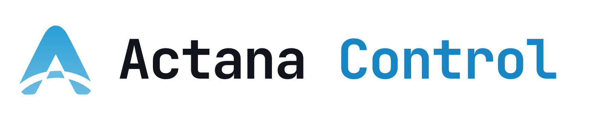
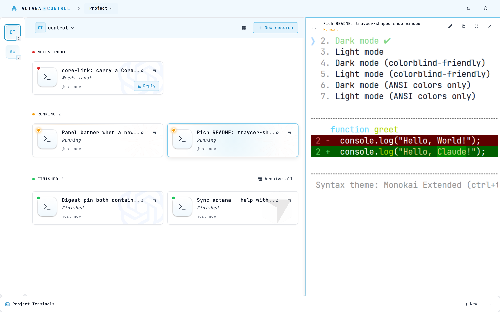
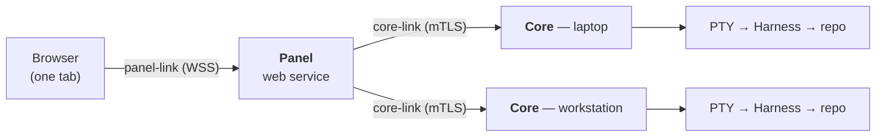
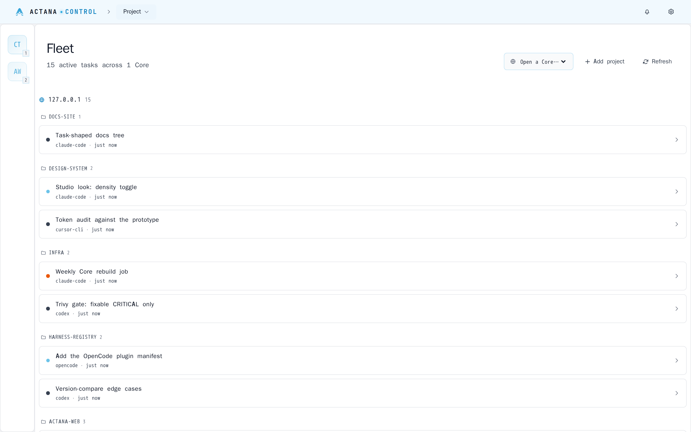

<p align="center">
  <picture>
    <source media="(prefers-color-scheme: dark)" srcset="docs/assets/logo-dark.png">
    <source media="(prefers-color-scheme: light)" srcset="docs/assets/logo-light.png">
    
  </picture>
</p>

<p align="center">
  <a href="docs/README.md">Docs</a> ·
  <a href="#quickstart">Quickstart</a> ·
  <a href="https://github.com/actana/control/releases">Releases</a> ·
  <a href="CONTRIBUTING.md">Contributing</a>
</p>

<p align="center">
  <a href="LICENSE"></a>
  <!-- Static until the first `v*` tag: shields' github/v/release endpoint has no
       fallback and renders "no releases or repo not found" against a repo with
       none, which reads as abandoned in the first screenful. At v0.1.0, restore:
       src="https://img.shields.io/github/v/release/actana/control?style=flat-square&labelColor=101723&color=279ed6&cacheSeconds=3600" -->
  <a href="https://github.com/actana/control/releases"></a>
  <a href="https://github.com/actana/control/actions/workflows/ci.yml"></a>
  <a href="https://github.com/actana/control/commits/main"></a>
  <a href="https://hub.docker.com/r/actana/panel"></a>
</p>

Actana Control is a self-hosted control plane for agentic coding. One web
**Panel** drives any number of **Cores** — machines running vendor coding CLIs
(Claude Code, Codex, Cursor CLI, OpenCode) in PTY sessions against your git
repos.

<p align="center">
  <picture>
    <source media="(prefers-color-scheme: dark)" srcset="docs/assets/panel-project-dark.png">
    <source media="(prefers-color-scheme: light)" srcset="docs/assets/panel-project-light.png">
    
  </picture>
</p>

<!--
  The harness banner. Full-colour marks are Harnesses that work today; the
  dashed, muted ones are the planned additions recorded in
  docs/domain-model.md § Harness. Keep that grammar — supported is solid,
  planned is dashed — and keep the paths relative so forks render.
-->
<p align="center">
  <a href="https://github.com/anthropics/claude-code" title="Claude Code — supported"></a>
  &nbsp;
  <a href="https://github.com/openai/codex" title="Codex — supported"></a>
  &nbsp;
  <a href="https://cursor.com/cli" title="Cursor CLI — supported"></a>
  &nbsp;
  <a href="https://opencode.ai" title="OpenCode — supported"></a>
  &nbsp;&nbsp;&nbsp;
  <a href="#supported-harnesses" title="Hermes — planned"></a>
  &nbsp;
  <a href="#supported-harnesses" title="Pi — planned"></a>
</p>

<p align="center">
  <b>Claude Code · Codex · Cursor CLI · OpenCode</b><br>
  <sub>work here today — <a href="#supported-harnesses">Hermes and Pi are next</a>, and the family is open</sub>
</p>

<!-- Demo recording goes here once it exists. Deliberately empty until then. -->

## Quickstart

> **Pre-release.** No `v*` tag is published yet, so `:latest` and the
> installer's `releases/latest` both 404. Until the first release, run the
> Compose path against **`:edge`** — the tag CI moves on every push to `main` —
> by changing the two `image:` lines in `deploy/docker-compose.yml`. The
> installer one-liner works from the first tag onward.

**Docker Compose** — a Panel and a Core on one network, which is the whole
product in one command:

```bash
git clone https://github.com/actana/control && cd control
docker compose -f deploy/docker-compose.yml up -d
docker compose -f deploy/docker-compose.yml logs core   # the registration blob
```

Open `http://localhost:7420`, create the Operator, and paste that blob into
"Add Core". [deploy/README.md](deploy/README.md) walks through the file itself
— the volumes, the loopback port, adding a second Core.

**Installer** — turn a Linux or macOS (arm64) machine into a Core, as your own
user, without sudo:

```bash
curl -fsSL https://raw.githubusercontent.com/actana/control/main/install.sh | bash
```

**Which one?** Compose if you want the whole thing on one host to try it;
the installer if you want a Core on a machine that already has your code — your
laptop, a workstation, a build box — paired to a Panel you deploy separately.

Full paths: [deploy/README.md](deploy/README.md) for the reference Compose,
[DEPLOY.md](DEPLOY.md) for the Panel, [INSTALL.md](INSTALL.md) for a Core.

## Features

- **One Panel, many machines.** The Panel holds no project or session state; it
  terminates a link to each Core and renders the union. Add a machine, and its
  work shows up in the same view.
- **Real terminals, not a transcript.** Every session is a PTY on the Core,
  streamed to the browser over one multiplexed WebSocket per tab. Type into it.
- **Your code never moves.** A Core runs on the machine that already has the
  repo. Nothing is uploaded, mirrored, or checked out anywhere else — and
  removing a project from the Panel **only unlinks it. It never touches your
  files.**
- **Status you can scan.** Sessions split into needs-input / running / finished,
  with per-project counts, so a machine asking a question is visible without
  opening it.
- **Harnesses install themselves.** `actana setup` offers the missing CLIs;
  `actana harnesses install <id>` adds one later.
- **Deploy it like a service.** Two published images, one reference compose
  file, a plain HTTP port behind your own proxy — no in-app updater, no
  certificate management. See [ADR 0010](docs/adr/0010-panel-becomes-a-self-hosted-web-service.md).

## Supported harnesses

A **Harness** is the vendor CLI a session drives. The **Supported** rows are the
compatibility promise, and they track `HARNESS_REGISTRY` in `@actana/shared`
one-for-one. The dashed rows below them are not in the registry yet — that is
what makes them coming soon.

| Harness | Command | Status | Auto-approve flag |
| --- | --- | --- | --- |
|  **Claude Code** | `claude` | Supported | `--dangerously-skip-permissions` |
|  **Codex** | `codex` | Supported | `--yolo` |
|  **Cursor CLI** | `cursor-agent` | Supported | `--force` |
|  **OpenCode** | `opencode` | Supported | — (none offered) |
|  Hermes | — | *Coming soon* | — |
|  Pi | — | *Coming soon* | — |

The dashed rows are the planned additions recorded in
[the domain model](docs/domain-model.md#harness) — the Panel already has a
"Coming soon" state for a registry entry that is not yet installable
([ADR 0021](docs/adr/0021-installing-a-harness-is-a-panel-gesture.md)), so they
appear as themselves rather than as a footnote.

The family is open by design
([ADR 0013](docs/adr/0013-core-is-the-machine-harness-is-the-cli.md)):
a Harness is one registry entry plus a launcher, and nothing in the Panel or the
core-link is specific to any of the four supported today. Using one that is not
here? [Open an issue](https://github.com/actana/control/issues/new) — that is
how a row gets added.

Each Core needs the CLIs it runs, installed under its own user — see
[Harness CLIs](INSTALL.md#harness-clis).

## How it works

The Panel is a web service you deploy once. Each Core is a daemon on a machine
that has your code; it owns the projects, the sessions, the SQLite database and
the PTYs, and it is the only process that writes its own state ([ADR 0004](docs/adr/0004-core-owns-write-path.md)).
The two speak over a **core-link**: a WebSocket the Panel dials, authenticated
by mutual TLS with material the Core mints at first run and hands over in its
registration blob ([ADR 0002](docs/adr/0002-core-link-auth-and-transport.md)).

What you expose: one HTTP port for the Panel, reachable by your browser, and on
each Core one port (default `8443`) reachable *from the Panel's machine* — the
Panel dials the Core, never the reverse, so that port needs no route from the
public internet. In the reference compose the two share a network and nothing
is published at all.



In the Panel, that diagram is one list — every Core's sessions in a single Fleet
view, whichever machine they are running on:

<p align="center">
  <picture>
    <source media="(prefers-color-scheme: dark)" srcset="docs/assets/panel-fleet-dark.png">
    <source media="(prefers-color-scheme: light)" srcset="docs/assets/panel-fleet-light.png">
    
  </picture>
</p>

More in [CONTEXT.md](CONTEXT.md) and [docs/adr/](docs/adr/).

## Security & privacy

**What stays on your machines: everything.** Your repos never leave the Core
that holds them. Sessions, projects, task history and each Harness's own
credentials live in that Core's home directory. The Panel keeps no task-shaped
state of its own — only the Core registry with each Core's sealed pairing
credentials, your Operator login, and the presentation layer it owns (project
grouping, card images, your preferences).

**The auth model.** The browser reaches the Panel with an Operator session
cookie ([ADR 0011](docs/adr/0011-operator-identity-and-panel-auth.md)); the
Panel reaches each Core over mutual TLS, pinned to the CA that Core minted,
with credentials sealed at rest under a key you can hold outside the data
volume. The Panel speaks plain HTTP and expects your own proxy to terminate TLS
— it never grows certificate-management code.

**What phones home: one request a day, and nothing else.** Once every 24 hours
the Panel and each Core ask
`https://api.github.com/repos/actana/control/releases/latest` whether a newer
release exists, cache the answer, and — if there is one — say so in a
dismissible banner and in `actana status`. Nothing is downloaded and nothing is
applied. Set `ACTANA_UPDATE_CHECK=0` to turn it off.

The only other outbound request is `registry.npmjs.org`, asked for the newest
published version of each Harness CLI while you have the Providers settings
page open, so it can tell you one is outdated. **No telemetry, no analytics, no
crash reporting** — nothing describing you, your code, or your usage is sent
anywhere, ever.

Reporting a vulnerability: [SECURITY.md](SECURITY.md).

## Documentation

[**docs/**](docs/README.md) is the index, organised by the task you actually
have — deploy a Panel, install a Core, configure it, back it up, contribute.

Start with [DEPLOY.md](DEPLOY.md) and [INSTALL.md](INSTALL.md); read
[CONTEXT.md](CONTEXT.md) before writing code, and [docs/adr/](docs/adr/) for why
the architecture is the way it is.

## Related Projects

| Project | Self-hosted | Browser UI | Live terminals | Many machines,<br>one control plane | Each machine<br>owns its state | Notes |
| --- | :---: | :---: | :---: | :---: | :---: | --- |
| **Actana Control** | ✅ | ✅ | ✅ | ✅ | ✅ | MIT |
| [Vibe Kanban](https://github.com/BloopAI/vibe-kanban) | ✅ | ✅ | — | — | — | Kanban-shaped planning over agent tasks. **Sunsetting** — Bloop shut down; community-maintained. |
| [claude-squad](https://github.com/smtg-ai/claude-squad) | ✅ | — | ✅ | — | — | Many sessions in tmux + worktrees — a Core's job, as a local TUI. AGPL-3.0. |
| [Happy](https://github.com/slopus/happy) | ✅ | ✅ | ✅ | — | — | End-to-end-encrypted mobile/web remote control of Claude Code and Codex; a client + relay. |
| [Claude Code UI](https://github.com/siteboon/claudecodeui) | ✅ | ✅ | ✅ | — | — | The closest single-node Panel analogue. AGPL-3.0. |
| [VibeTunnel](https://github.com/amantus-ai/vibetunnel) | ✅ | ✅ | ✅ | — | — | The PTY-over-web layer on its own, without the fleet above it. |
| [cmux](https://github.com/manaflow-ai/cmux) | ✅ | — | ✅ | — | — | Concurrent-session legibility as a native macOS terminal. GPL-3.0, macOS-only. |
| [Emdash](https://github.com/generalaction/emdash) | ✅ | ✅ | ✅ | — | — | Parallel CLIs in worktrees with a UI. |

<sup>Read from each project's own README on 2026-08-06. If a row is wrong or out
of date, [open an issue](https://github.com/actana/control/issues/new) — the
point of the table is to help you pick, not to win an argument.</sup>

Everyone in this list is self-hosted and most render a terminal in a browser;
those are table stakes, not a differentiator. **What sets Actana apart is the
last two columns**: one Panel over many machines, each owning its own state.
[ADR 0001](docs/adr/0001-detach-core-from-panel.md) is why the Core was detached
from the Panel in the first place.

## Contributing

Issues and PRs are welcome — start with [CONTRIBUTING.md](CONTRIBUTING.md), and
read [CONTEXT.md](CONTEXT.md) first for the vocabulary reviewers use.
[SUPPORT.md](SUPPORT.md) says where questions, bugs and feature requests each
go; participation is governed by the [Code of Conduct](CODE_OF_CONDUCT.md).

> **Security problems never go in a public issue.** Report them through
> [private advisories](https://github.com/actana/control/security/advisories/new)
> — see [SECURITY.md](SECURITY.md).

## License

[MIT](LICENSE). A derivative work of Mission Control by AgentSystem Labs — see
[NOTICE](NOTICE) for attribution.
