# 0.5.0 Panel proposal (dark)

The screens for Release 0.5.0 (#552), exported from the Figma file
[Control › Proposal — 0.5.0 (Dark)](https://www.figma.com/design/aS8a8z7C0qhRRVWwkt5EtH/Control?node-id=44-5289).
Figma is the source; these PNGs are a snapshot at 2×, so issues and reviews can show them.

**This is the reference for every 0.5.0 redesign ticket.** A UI PR that departs from a screen
says why in its description, and the screen is updated in Figma first.

| # | Screen | Figma | Issues |
|---|---|---|---|
| 00 | Cover and index | [44:5290](https://www.figma.com/design/aS8a8z7C0qhRRVWwkt5EtH/Control?node-id=44-5290) | #552 |
| 01 | Fleet (home) | [44:6998](https://www.figma.com/design/aS8a8z7C0qhRRVWwkt5EtH/Control?node-id=44-6998) | #560 |
| 02 | Core › Sessions, with the Terminal drawer | [44:5619](https://www.figma.com/design/aS8a8z7C0qhRRVWwkt5EtH/Control?node-id=44-5619) | #560, #555, #556 |
| 03 | New Session | [44:5948](https://www.figma.com/design/aS8a8z7C0qhRRVWwkt5EtH/Control?node-id=44-5948) | #560, #555, #563 |
| 04 | Core › Files (a Drive for the Shared folder) | [44:6525](https://www.figma.com/design/aS8a8z7C0qhRRVWwkt5EtH/Control?node-id=44-6525) | #565, #557, #561 |
| 05 | Pairing › Shared folder | [44:6902](https://www.figma.com/design/aS8a8z7C0qhRRVWwkt5EtH/Control?node-id=44-6902) | #564, #562 |
| 06 | Tasks board | [44:7199](https://www.figma.com/design/aS8a8z7C0qhRRVWwkt5EtH/Control?node-id=44-7199) | #571 |
| 06b | New Task | [47:7164](https://www.figma.com/design/aS8a8z7C0qhRRVWwkt5EtH/Control?node-id=47-7164) | #571, #568, #569 |
| 07 | Task detail | [44:7696](https://www.figma.com/design/aS8a8z7C0qhRRVWwkt5EtH/Control?node-id=44-7696) | #571, #570 |
| 08 | Settings › Storage | [44:8051](https://www.figma.com/design/aS8a8z7C0qhRRVWwkt5EtH/Control?node-id=44-8051) | #565, #566 |
| 09 | Settings › API & integrations | [44:8589](https://www.figma.com/design/aS8a8z7C0qhRRVWwkt5EtH/Control?node-id=44-8589) | #572, #573, #574 |

## Decisions the screens fix

- **No Projects.** The rail lists Cores; a Core opens to **Sessions · Files · Tasks**.
- **The Terminal is a bottom drawer, not a tab** (header icon or ctrl+backtick): a shell as `core` in `~`, no sudo.
  The Sessions grid shows harness Sessions only.
- **New Session is prompt-first.** No path or cwd field; every Session starts in `~`, and focus goes in the prompt.
- **Files is a Drive for `~/shared`:** a recursive folder tree, folder tiles and file cards with previews,
  a details pane (Download, Copy path, Rename, Move, Delete) and a **New** menu (New folder, Upload files,
  Upload folder with its tree, New text file). It reads S3 directly, so it works while the Core is offline.
- **Tasks live on the Panel:** a board across Cores, a New Task dialog (title, markdown description,
  Core then Agent, attachments into `shared/tasks/<id>/`, start now or save as draft) and a detail view
  with a large multi-line composer (Comment, or Comment & re-assign).
- **Pairing ends with the Shared folder** for a Panel; Settings holds Storage and API & integrations.

## Screens

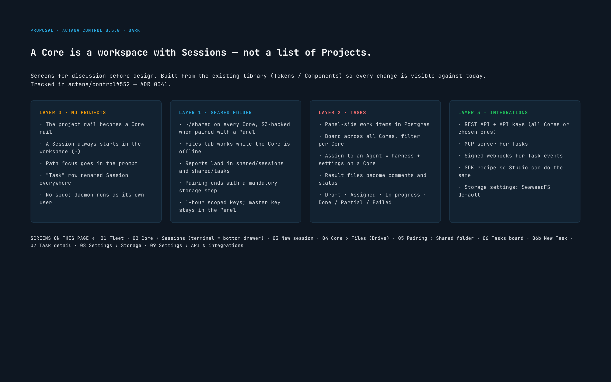
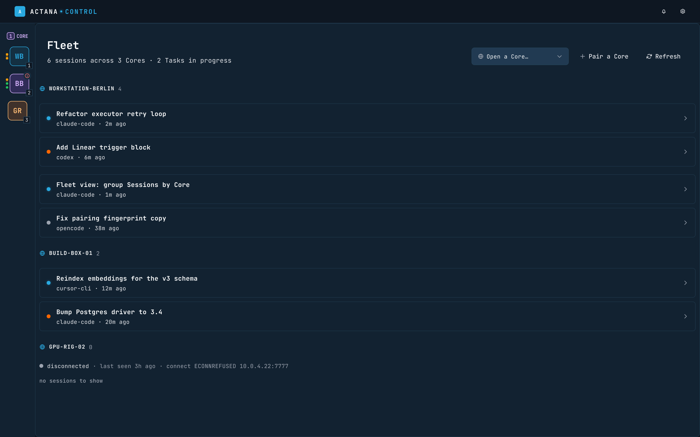
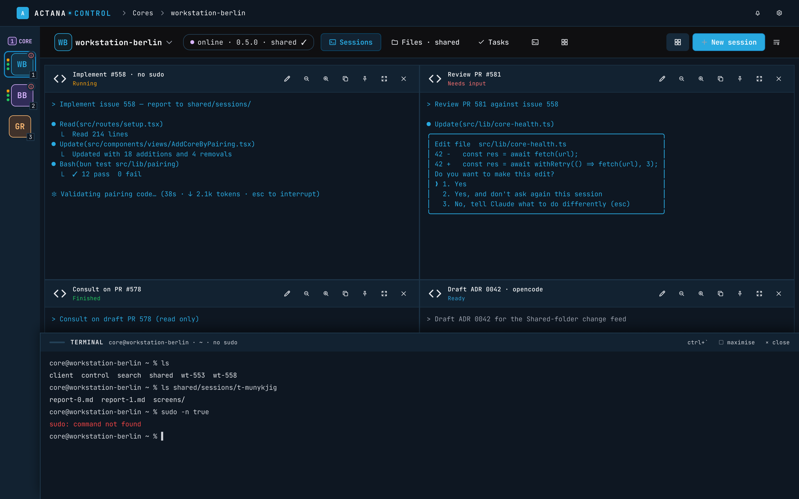
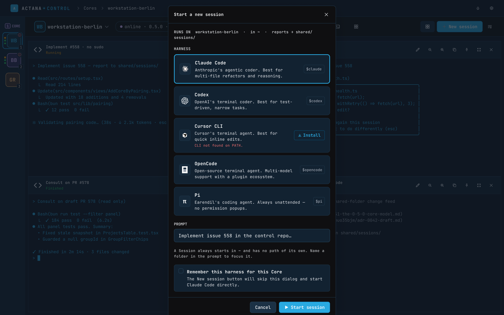
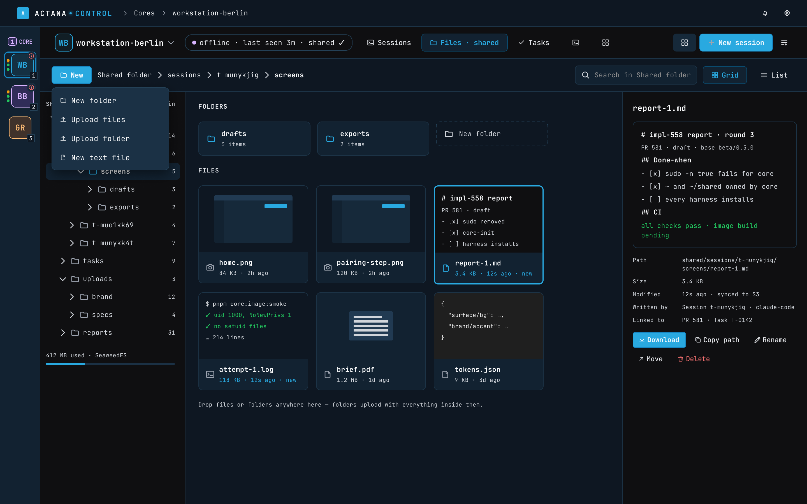
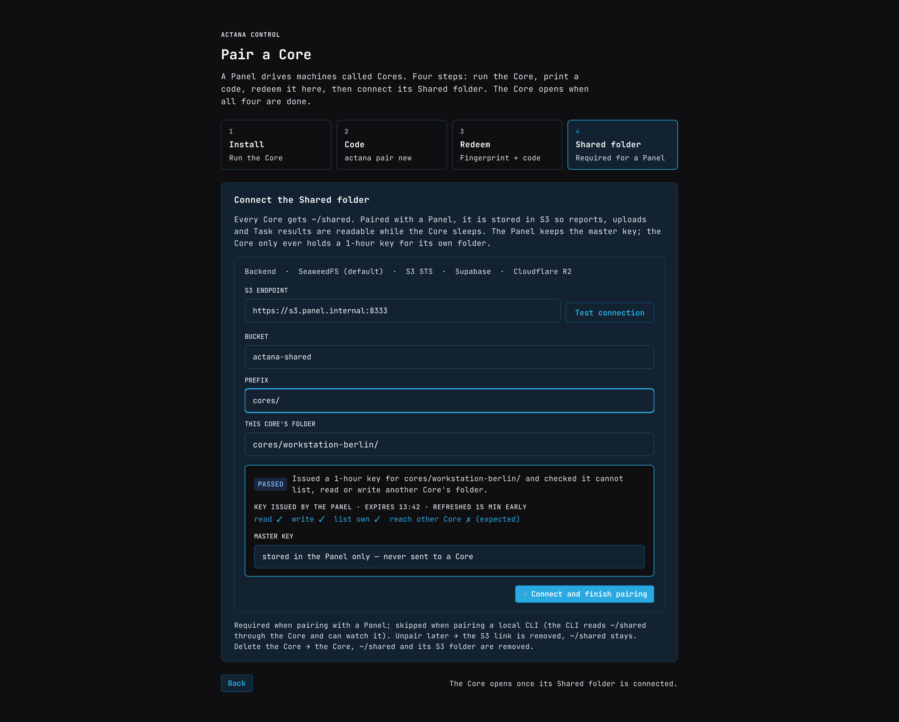
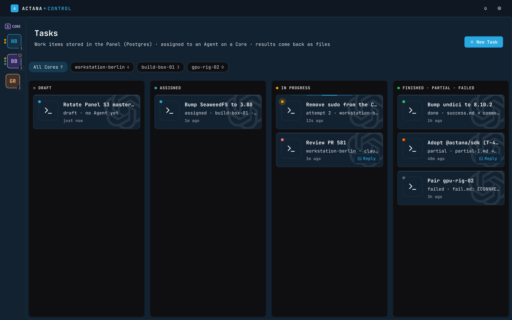
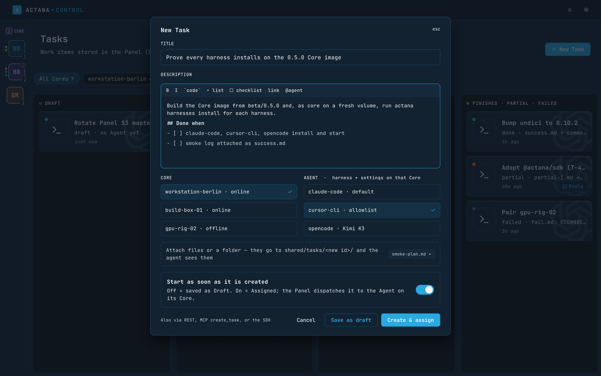
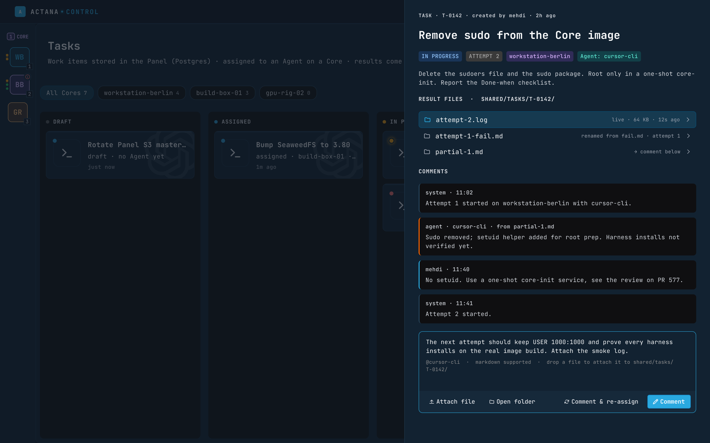
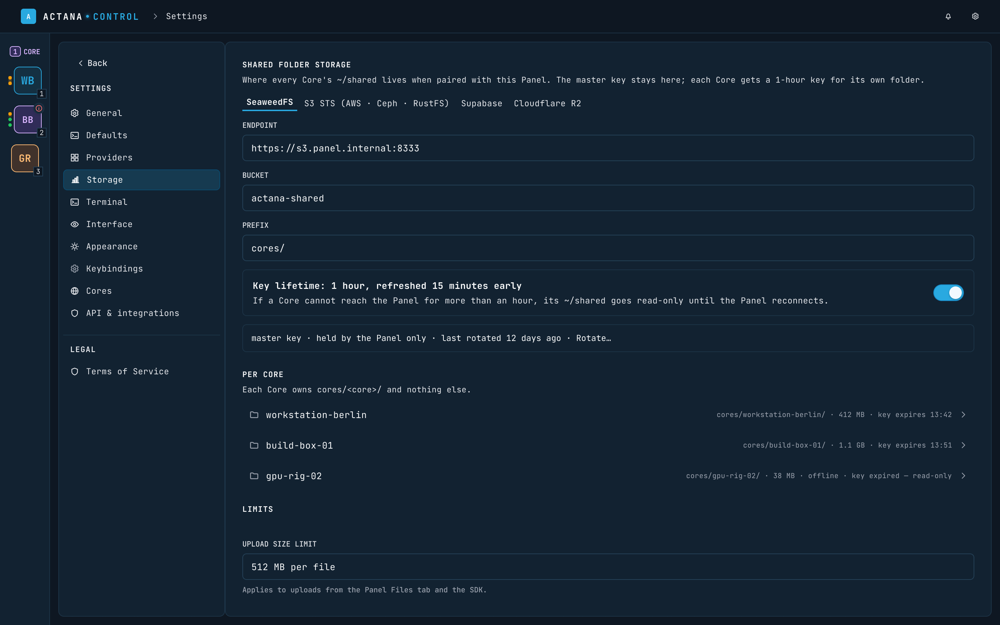
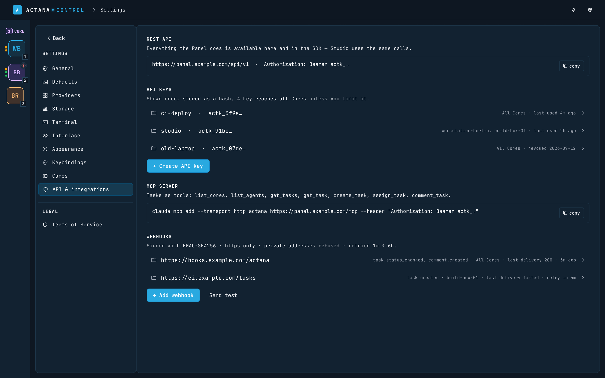
